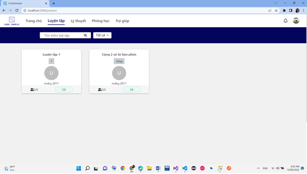
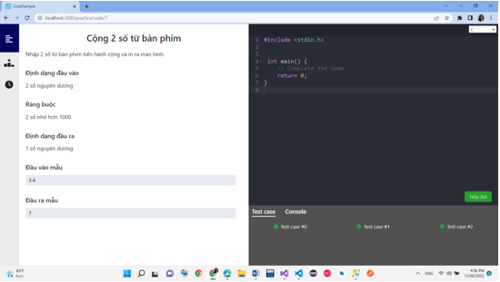
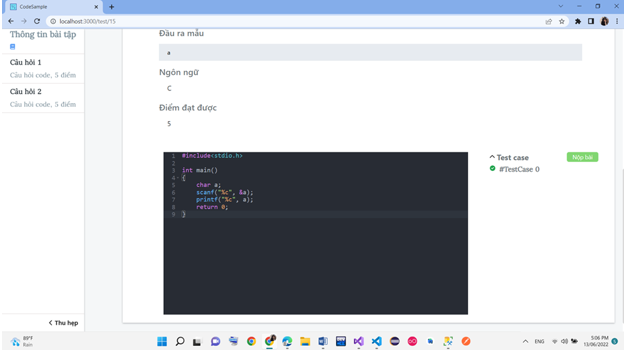
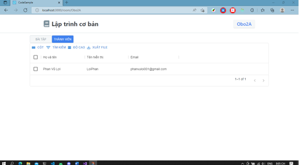

### DA_CODESAMPLE

Đây là bài tập trên lớp được nhóm xây dựng
Lấy ý tưởng từ việc luyện tập viết code qua các bài tập và viết các dòng code trên website mà không cần phải tải IDE hay ngôn ngữ lập trình về máy tính

### Các chức năng đã làm
Lý thuyết: Người dùng có thể xem các bài lý thuyết
Bài tập luyện tập: Hiện thị danh sách các bài luyện tập các bài tập có chia theo cấp độ, người dùng chọn một bài và sau đó viết code, các bài tập sẽ testcase để tính điểm
Phòng học: Người dùng có thể tạo phòng học và giao bài tập cho các thành viên trong nhóm các bài ở đây sẽ theo dạng câu hỏi code, các thành viên sẽ tiến hành làm bài và nộp bài  

Danh các câu hỏi luyện tập  
  
Làm câu hỏi  
  
Làm bài tập trong phòng học  
  
Danh sách thành viên trong phòng học  
  